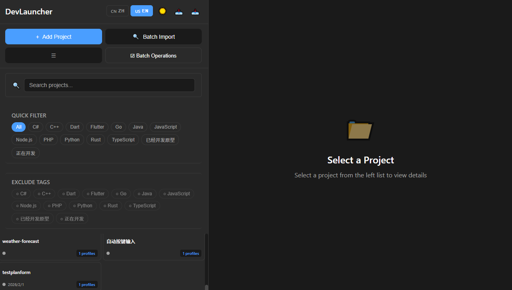
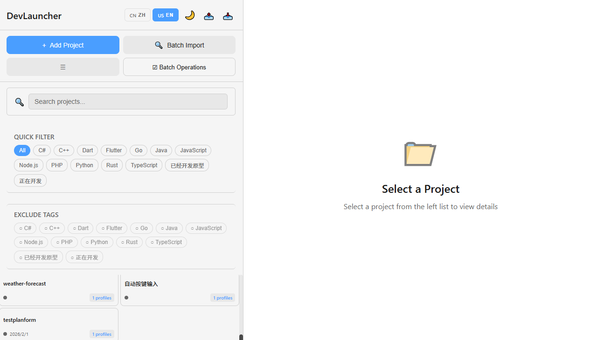
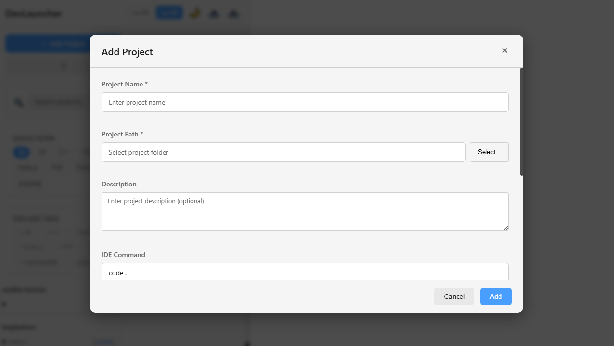
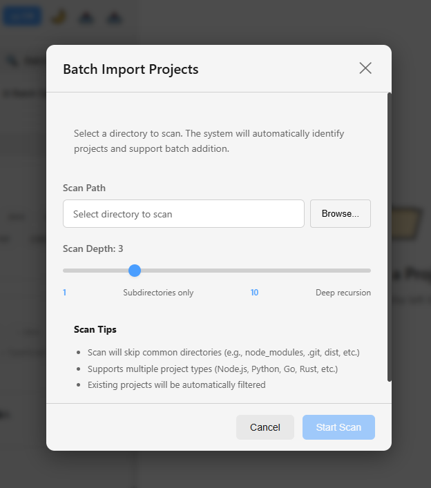
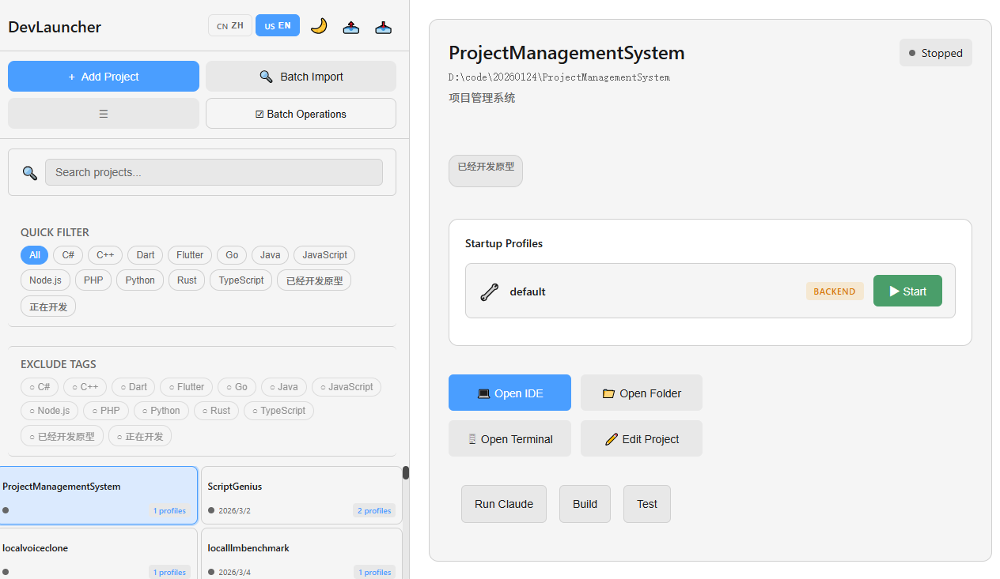
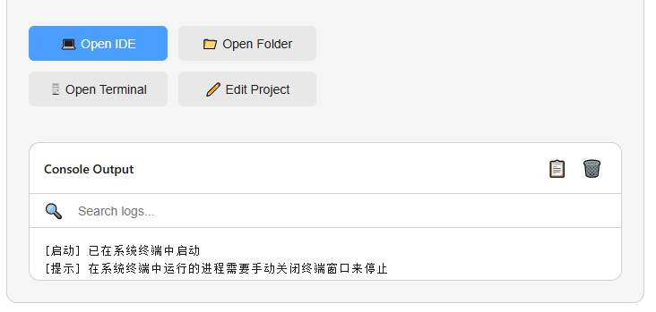

# DevLauncher

<div align="center">

**本地开发项目管理系统**

一个功能强大的桌面应用，帮助开发者高效管理多个本地开发项目。

[](https://opensource.org/licenses/MIT)
[](https://www.electronjs.org/)
[](https://react.dev/)

[English Documentation](README.md) | [中文文档](README.zh-CN.md)

</div>

## 界面截图

### 主界面（深色主题）


### 主界面（浅色主题）


### 添加项目对话框


### 批量导入


### 启动配置


### 日志查看器


## 功能特性

### 项目管理

- ✅ 添加/编辑/删除项目
- ✅ 项目列表展示与状态监控
- ✅ 搜索和筛选项目（按名称、路径、标签）
- ✅ 项目分组管理
- ✅ 持久化项目配置存储
- ✅ 批量导入项目（自动扫描目录）
- ✅ 批量操作（启动/停止/删除）
- ✅ 导入/导出项目配置
- ✅ 虚拟滚动支持（优化大型项目列表）

### 核心交互

- ✅ 多启动配置支持（前端/后端/Docker）
- ✅ 一键启动/停止项目
- ✅ 打开 IDE（支持 VS Code、Cursor 等）
- ✅ 打开系统终端（跨平台支持）
- ✅ 打开项目文件夹
- ✅ 自定义命令执行
- ✅ 实时日志输出与搜索
- ✅ 日志复制和清空功能

### UI/UX

- ✅ 现代化深色/浅色主题
- ✅ 国际化支持（中文/英文）
- ✅ 响应式布局
- ✅ 网格/列表视图切换
- ✅ 消息提示
- ✅ 空状态指示器
- ✅ 错误边界保护
- ✅ README 预览（Markdown 支持）
- ✅ 标签过滤和排除

### 技术优化

- ✅ 代码分割和懒加载
- ✅ 虚拟滚动优化
- ✅ Zustand 状态管理
- ✅ 组件模块化
- ✅ TypeScript 类型安全
- ✅ 完善的单元测试覆盖

## 技术栈

- **桌面框架**: Electron 40 + React 19
- **编程语言**: TypeScript 5.7
- **构建工具**: Vite 6
- **状态管理**: Zustand 5
- **国际化**: i18next + react-i18next
- **终端模拟**: node-pty
- **数据存储**: JSON 文件
- **样式**: CSS3
- **测试**: Vitest 3 + Testing Library

## 安装

### 环境要求

- Node.js >= 18.0.0
- 操作系统: Windows 10+, macOS 10.15+, Linux

### 克隆项目

```bash
git clone https://github.com/Jasper-Leung/devlauncher.git
cd devlauncher
```

### 安装依赖

```bash
npm install
```

## 开发

### 启动开发服务器

```bash
npm run dev
```

### 启动 Electron 开发模式

```bash
npm run electron:dev
```

这将同时启动 Vite 开发服务器和 Electron 应用。

### 构建

```bash
npm run build
```

### 打包应用

```bash
npm run electron:build
```

## 使用说明

### 添加项目

1. 点击"添加项目"按钮
2. 选择项目文件夹
3. 系统将自动检测项目信息（名称、类型、启动命令等）
4. 配置启动配置（可以添加多个）：
   - 前端项目（如 Vite、Webpack）
   - 后端项目（如 Node.js、Python）
   - Docker 容器
5. 保存项目

### 启动项目

1. 从左侧边栏选择项目
2. 选择启动配置并点击"启动"按钮
3. 日志将实时显示在控制台输出区域
4. 支持日志搜索和复制

### 打开 IDE/终端

- 点击"打开 IDE"在配置的 IDE 中打开项目
- 点击"打开文件夹"在系统文件管理器中打开项目
- 点击"打开终端"在系统终端中打开项目目录

### 批量操作

1. 点击"批量操作"按钮进入批量模式
2. 选择多个项目
3. 执行批量启动/停止/删除操作
4. 查看实时进度

### 批量导入

1. 点击"批量导入"按钮
2. 选择要扫描的根目录
3. 设置扫描深度（1-10 层）
4. 系统自动识别并显示所有项目
5. 选择要导入的项目并完成导入

### 项目分组

1. 点击"管理分组"按钮
2. 创建新分组或删除现有分组
3. 编辑项目时选择分组
4. 使用分组过滤器快速筛选项目

### 国际化

点击侧边栏顶部的语言切换器按钮（🇨🇳/🇺🇸）在中英文之间切换。语言偏好会自动保存。

## 键盘快捷键

- `Ctrl + N`: 添加新项目
- `Ctrl + O`: 在 IDE 中打开选中项目
- `Ctrl + Space`: 启动/停止选中项目
- `Ctrl + E`: 编辑选中项目
- `Ctrl + D`: 导出项目配置
- `Ctrl + I`: 导入项目配置
- `Delete`: 删除选中项目
- `Escape`: 关闭对话框或取消选择

## 项目结构

```
devlauncher/
├── src/
│   ├── main/                    # Electron 主进程
│   │   ├── main.ts             # 应用入口
│   │   ├── preload.js          # IPC 通信桥梁
│   │   └── services/
│   │       ├── ProjectService.ts        # 项目数据管理
│   │       ├── CommandService.ts        # 命令执行服务
│   │       ├── DialogService.ts         # 文件对话框服务
│   │       ├── DirectoryScanService.ts  # 目录扫描服务
│   │       ├── BatchImportService.ts    # 批量导入服务
│   │       └── ProjectDetectionService.ts # 项目类型检测
│   ├── renderer/               # React 渲染进程
│   │   ├── App.tsx             # 主应用组件
│   │   ├── main.tsx            # React 入口
│   │   ├── index.css           # 全局样式
│   │   ├── i18n/               # 国际化配置
│   │   │   ├── index.ts        # i18next 配置
│   │   │   ├── config.ts       # 语言类型定义
│   │   │   └── locales/        # 翻译文件
│   │   │       ├── zh/         # 中文翻译
│   │   │       └── en/         # 英文翻译
│   │   ├── components/         # UI 组件
│   │   │   ├── ProjectSidebar.tsx      # 项目侧边栏
│   │   │   ├── MainContent.tsx         # 主内容区域
│   │   │   ├── ProjectList.tsx         # 项目列表
│   │   │   ├── VirtualProjectList.tsx  # 虚拟滚动列表
│   │   │   ├── AddProjectModal.tsx     # 添加项目对话框
│   │   │   ├── GroupManagerModal.tsx   # 分组管理对话框
│   │   │   ├── BatchImportModal.tsx    # 批量导入对话框
│   │   │   ├── BatchActions.tsx        # 批量操作组件
│   │   │   ├── StartupProfiles.tsx     # 启动配置组件
│   │   │   ├── LogViewer.tsx           # 日志查看器
│   │   │   ├── LanguageSwitcher.tsx    # 语言切换器
│   │   │   └── Toast.tsx               # 消息提示
│   │   ├── stores/             # 状态管理
│   │   │   ├── uiStore.ts      # UI 状态
│   │   │   ├── projectStore.ts # 项目状态
│   │   │   └── batchStore.ts   # 批量操作状态
│   │   ├── hooks/              # 自定义 Hooks
│   │   ├── utils/              # 工具函数
│   │   └── global.d.ts         # 全局类型定义
│   ├── test/                   # 测试文件
│   └── shared/
│       ├── types.ts            # 类型定义
│       ├── projectTypeConfig.ts # 项目类型配置
│       └── errorTypes.ts       # 错误类型定义
├── package.json
├── tsconfig.json               # 渲染进程 TS 配置
├── tsconfig.electron.json      # 主进程 TS 配置
├── vite.config.ts              # Vite 构建配置
└── index.html                  # HTML 入口
```

## 测试

```bash
# 运行测试
npm test

# 运行测试并生成覆盖率报告
npm run test:coverage

# 在 UI 中查看测试结果
npm run test:ui
```

## 代码质量

```bash
# 运行 ESLint 检查
npm run lint

# 自动修复 ESLint 问题
npm run lint:fix

# 格式化代码
npm run format
```

## 未来计划

- [ ] Docker 容器集成
- [ ] 环境变量管理
- [ ] 日志历史持久化

## 贡献

欢迎贡献代码！请阅读 [CONTRIBUTING.md](CONTRIBUTING.md) 了解如何参与贡献。

## 许可证

本项目采用 [MIT](LICENSE) 许可证。

## 致谢

感谢所有为本项目做出贡献的开发者。

---

<div align="center">

Made with ❤️ by Jasper-Leung

</div>
